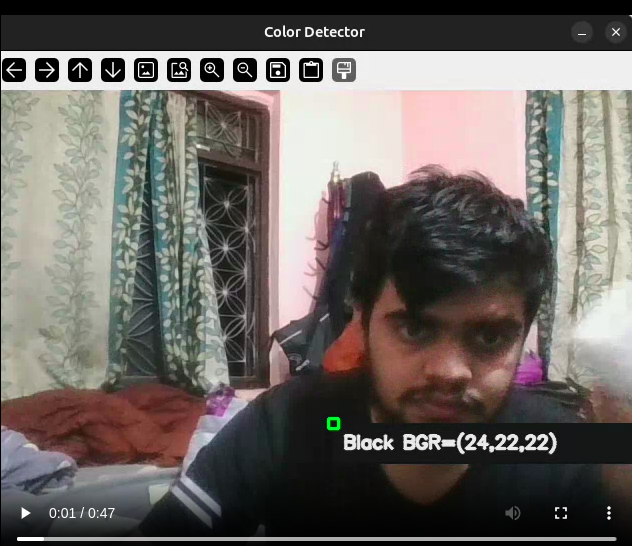
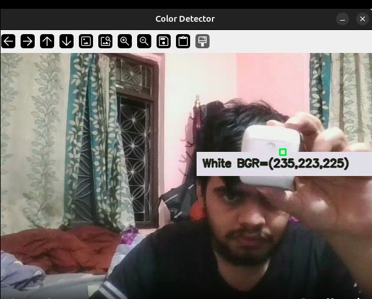
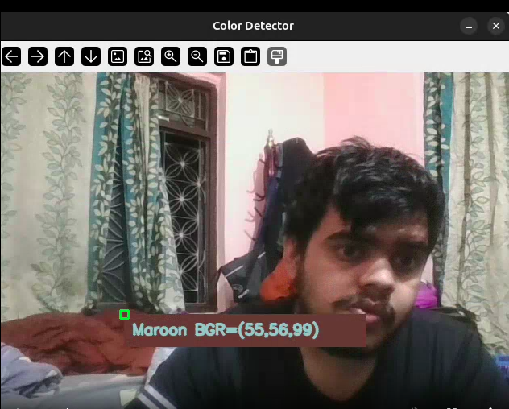

# 🎨 Color Detection with OpenCV

This project is part of a two-task computer vision assignment built using Python and OpenCV.

Task 1 involves Basic Image Manipulation using opencv.

Task 2 is a Real-Time Color Detector (Webcam-Based) using opencv.
 
 ---

# Task 1: Basic Image Manipulation
Load an image of your choice and apply the following operations:

Convert to Grayscale

Apply Gaussian Blur

Detect Edges using Canny Edge Detector

I had done this in juyter notebook and each processed image is saved in  'output_images' folder

# How to Run :-
1.Set Up Virtual Environment (Optional)

```bash
python -m venv cv_env
source cv_env/bin/activate  # On Windows: cv_env\Scripts\activate
```

2.Install Dependencies
```bash
pip install -r requirements.txt
```
3.Open the jupyter notebook and run the code using jupyter notebook
```bash
jupyter notebook
```
---

# Task 2: Real-Time Color Detector (Webcam-Based)
This task demonstrates real-time computer vision interaction using Python and OpenCV. The script opens your webcam and lets you click anywhere on the live feed to get:

    The BGR color values at the clicked pixel.

    The closest color name from a predefined list of main colors (like red, green, blue, etc.).

This tests both your OpenCV fundamentals and your ability to handle mouse events using cv2.setMouseCallback().

# How to Run the Script:-

1.Set Up Virtual Environment (Optional)

```bash
python -m venv cv_env
source cv_env/bin/activate  # On Windows: cv_env\Scripts\activate
```

2.Install Dependencies

```bash
pip install -r requirements.txt
```

3.Run the code_detector.py file 

```bash
python "02)task_two/color_detector.py"
```

4.Interact with the Webcam Window   
    Left-click anywhere on the webcam feed.  
    A colored rectangle with the BGR values and the name of the closest matching color will appear.
    Press q to quit the webcam popup frame.

# Example Outputs (Screenshots)






